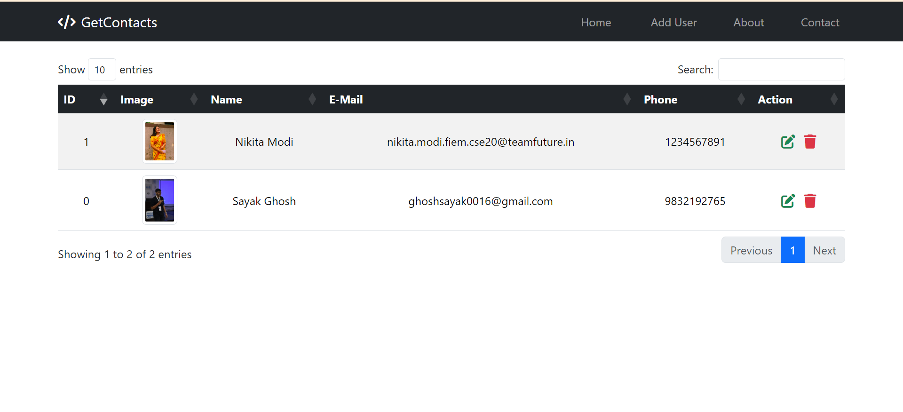
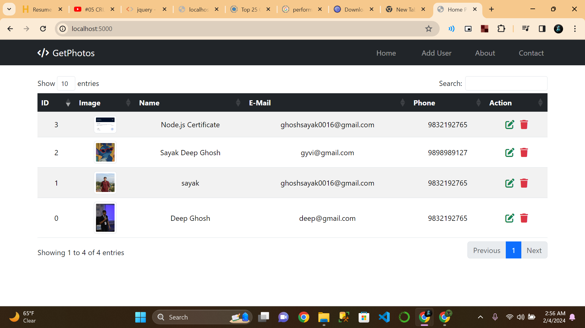

# Get Photos Application



📸 Welcome to the Get Photos application! This Node.js application
allows users to store and manage their data, including user name, photo,
phone number, and email. With features like editing and deleting, it
provides a seamless experience for managing your information.

## Technologies Used

🛠️ The application is built using the following technologies:

-   Node.js
-   Express
-   MongoDB
-   EJS (Embedded JavaScript templates)

## Dependencies

📦 Make sure to install the required dependencies using the following
commands:

``` bash
npm install dotenv@^16.4.1
npm install ejs@^3.1.9
npm install express@^4.18.2
npm install express-session@^1.18.0
npm install mongoose@^8.1.1
npm install multer@^1.4.5-lts.1
```

## Development Dependencies

🚀 Additionally, the following development dependency is used:

``` bash
npm install nodemon@^3.0.3 --save-dev
```

## Getting Started

🚀 Follow these steps to get the application up and running:

1.  Clone the repository:

``` bash
git clone https://github.com/your-username/get-photos-app.git
```

2.  Navigate to the project directory:

``` bash
cd get-photos-app
```

3.  Install dependencies:

``` bash
npm install
```

4.  Run the application:

``` bash
npm start
```

The application will be accessible at `http://localhost:3000`.

## Functionality

🔧 The Get Photos application provides the following functionality:

-   **Add Data:** Users can store their data by providing a user name,
    photo, phone number, and email.
-   **Edit Data:** Users have the option to edit their information.
-   **Delete Data:** In case of any updates or changes, users can delete
    their existing data.

Feel free to explore and make the most out of the Get Photos
application! If you encounter any issues or have suggestions, please
don't hesitate to [create an
issue](https://github.com/your-username/get-photos-app/issues).

Happy capturing moments with Get Photos! 📷

